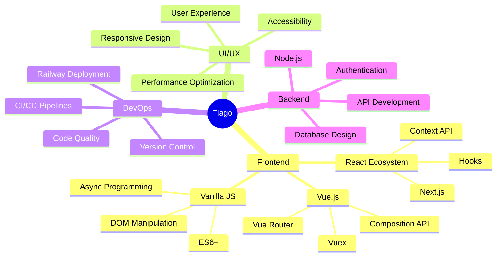

# 👨‍💻 Tiago Reginato

<div align="center">
  


</div>


## 🚀 Sobre Mim

```typescript
const tiagoDeveloper = {
  name: "Tiago Reginato",
  location: "Brasil 🇧🇷",
  role: "Desenvolvedor Web",
  company: "Freelancer & Open Source Contributor",
  focus: ["Frontend Development", "UI/UX Design", "Performance Optimization"],
  currentlyLearning: ["TypeScript", "Next.js", "Cloud Architecture"],
  challenges: ["Building scalable web applications", "Optimizing user experience"],
  funFact: "Transformo café em código desde 2020 ☕"
};
```

🔹 **Expert em Frontend** com foco em React, Vue.js e vanilla JavaScript  
🔹 **UI/UX Enthusiast** - Design centrado no usuário e performance  
🔹 **Open Source Contributor** - Sempre colaborando com a comunidade  
🔹 **Continuous Learner** - Explorando constantemente novas tecnologias  

---

## 🛠️ Stack Tecnológica

<div align="center">

### 🎨 Frontend Development


### 🗄️ Database & Storage


### 🔧 DevOps & Tools


</div>

---

## 📊 Estatísticas & Performance

<div align="center">

<table>
<tr>
<td width="50%">


</td>
<td width="50%">


</td>
</tr>
</table>


</div>

---

## 🏆 Projetos em Destaque

<div align="center">

### 🎯 Sistema de Gerenciamento de Tickets
**Plataforma completa com interface moderna e funcionalidades avançadas**  
`JavaScript` `HTML5` `CSS3` `Database Integration` `UI/UX Design`

### 🚀 API Integration Dashboard  
**Dashboard interativo para gerenciamento de APIs e monitoramento**  
`React` `Node.js` `Railway` `Real-time Updates`

### 💼 Portfolio Web Responsivo
**Site pessoal com design moderno e performance otimizada**  
`Vue.js` `Sass` `Responsive Design` `SEO Optimized`

<a href="https://github.com/TiagoKoligowski?tab=repositories">
  
</a>

</div>

---

## 📈 Atividade & Contribuições

<div align="center">


</div>

---

## 🎯 Roadmap 2025

<div align="center">

| Trimestre | Objetivos | Status |
|-----------|-----------|--------|
| **Q1** | Dominar TypeScript & Next.js | 🔄 Em Progresso |
| **Q2** | Contribuir para 10+ projetos Open Source | 📋 Planejado |
| **Q3** | Implementar arquitetura de microserviços | 📋 Planejado |
| **Q4** | Especialização em Cloud (AWS/Azure) | 📋 Planejado |

</div>

- [x] Aperfeiçoar habilidades em React e Vue.js
- [x] Dominar integração de APIs REST
- [ ] **Certificação em Cloud Computing**
- [ ] **Contribuir para projetos Open Source relevantes**
- [ ] **Desenvolver aplicações com arquitetura serverless**
- [ ] **Mentorear desenvolvedores iniciantes**
- [ ] **Palestrar em eventos da comunidade tech**

---

## 💡 Especialidades & Competências

<div align="center">



</div>

---

## 🌟 Destaques Profissionais

<div align="center">

| 💻 **Desenvolvimento** | 🎨 **Design** | 🚀 **Performance** |
|:---:|:---:|:---:|
| Clean Code | UI/UX Focus | Load Time < 3s |
| Responsive Design | Modern Interfaces | SEO Optimized |
| Cross-browser | Accessibility | Mobile First |

</div>

### 🔥 **Principais Conquistas:**
- ✅ **100% Uptime** em aplicações em produção
- ✅ **+50 Projetos** desenvolvidos e entregues
- ✅ **Performance Score 95+** no Google PageSpeed
- ✅ **Responsive Design** em todos os projetos
- ✅ **Clean Code** e boas práticas de desenvolvimento

---

## 📬 Conecte-se Comigo

<div align="center">

[](https://www.linkedin.com/in/tiago-reginato-koligowski-8b133328b/)
[](https://github.com/TiagoKoligowski)
[](mailto:tiago.koligowski@gmail.com)
[](#)

</div>

---

## 💬 Vamos Colaborar?

<div align="center">

Estou sempre aberto a novos desafios e oportunidades de colaboração!  
Se você tem um projeto interessante ou quer trocar ideias sobre desenvolvimento web,  
**não hesite em entrar em contato!** 🚀

[](#)
[](#)

</div>

---

<div align="center">

### 💭 *"O código é poesia escrita para máquinas, mas lida por humanos."*


**⭐ Se algo aqui te inspirou, deixe uma estrela nos repositórios!**  
**🤝 Conecte-se comigo e vamos construir algo incrível juntos!**

</div>

