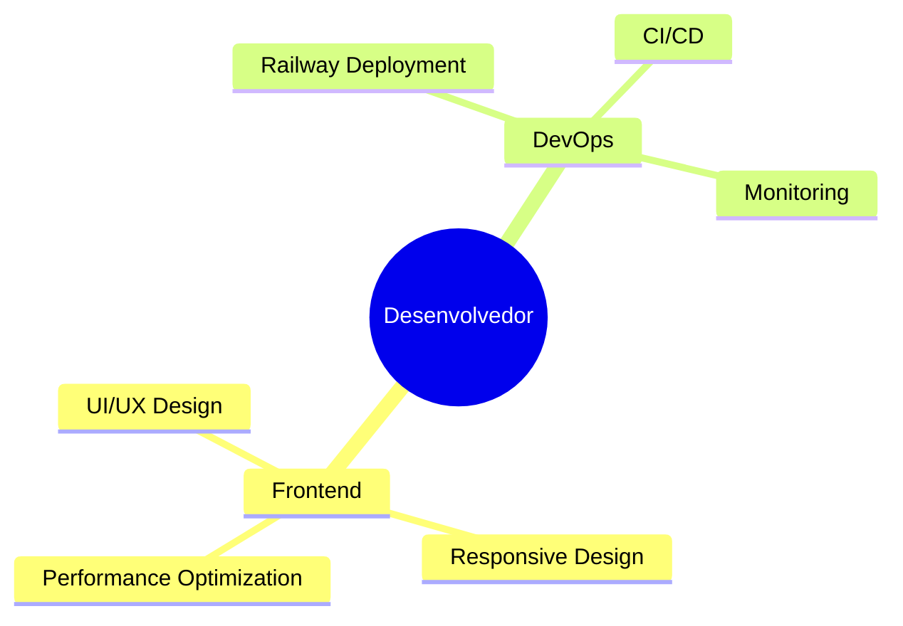

# 👋 Olá! Eu sou Tiago Reginato

  

🔹 **Desenvolvedor apaixonado** por criar interfaces intuitivas e sistemas robustos  
🔹 **Focado** em experiência do usuário e performance  
🔹 **Sempre explorando** novas tecnologias e metodologias  

---

## 🛠️ Tecnologias & Ferramentas

### Frontend

### Banco de Dados

### Ferramentas & Plataformas

---

## 📊 Estatísticas do GitHub

  

---

## 📈 Contribuições & Atividade

  

---

## 🎯 Objetivos para 2025

- [ ] Contribuir para mais projetos open source
- [ ] Aprender novas tecnologias (ex: TypeScript, Next.js)
- [ ] Desenvolver projetos pessoais inovadores
- [ ] Melhorar habilidades em DevOps e Cloud
- [ ] Participar de eventos e comunidades tech

---

## 💡 Experiências & Especializações

### 🔧 Áreas de Expertise

---

## 📫 Vamos Conversar?

)

---

**⭐ Deixe uma estrela nos repositórios que você gostar!**

